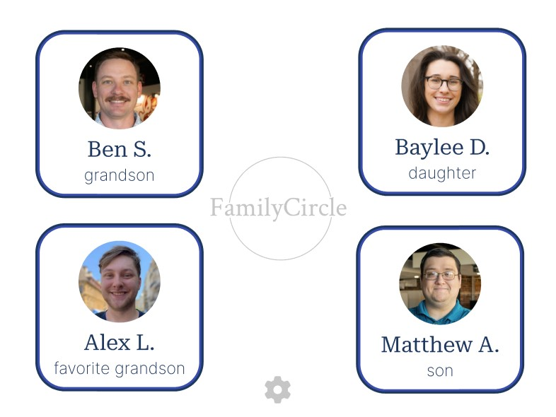
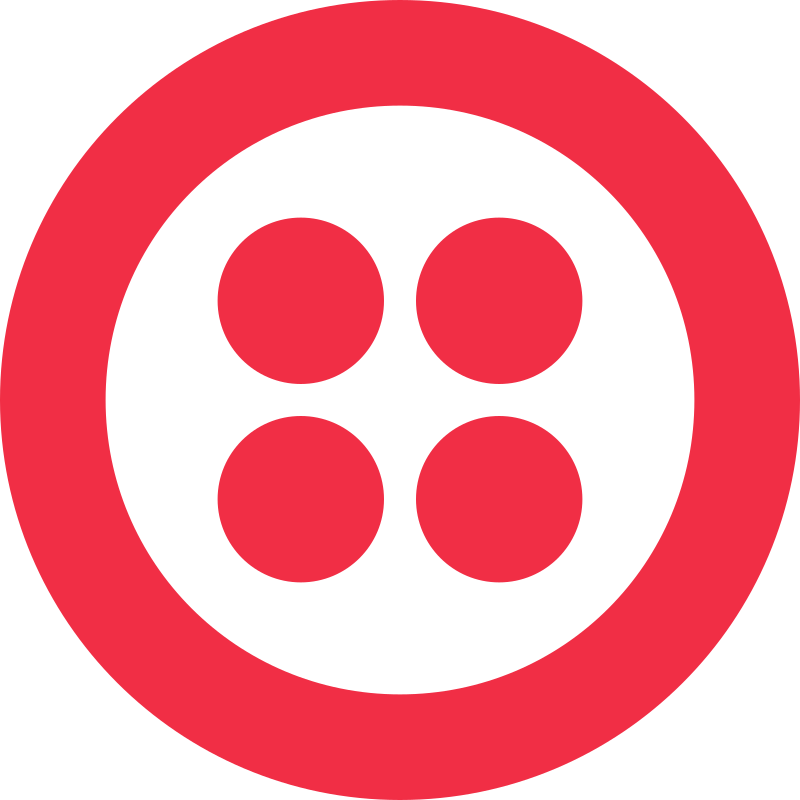

<!-- PROJECT LOGO -->
<!--suppress HtmlDeprecatedAttribute -->
 

  

<!-- TABLE OF CONTENTS -->

  
Table of Contents

  <ol>
    <li>
      <a href="#about-the-project">About The Project</a>
      <ul>
        <li><a href="#built-with">Built With</a></li>
      </ul>
    </li>
    <li>
      <a href="#getting-started">Getting Started</a>
      <ul>
        <li><a href="#prerequisites">Prerequisites</a></li>
        <li><a href="#installation">Installation</a></li>
      </ul>
    </li>
    <li><a href="#usage">Usage</a></li>
    <li><a href="#roadmap">Roadmap</a></li>
    <li><a href="#contributing">Contributing</a></li>
    <li><a href="#license">License</a></li>
    <li><a href="#contact">Contact</a></li>
    <li><a href="#acknowledgments">Acknowledgments</a></li>
  </ol>

<!-- ABOUT THE PROJECT -->
## About The Project
Family Circle is a simple and accessible web app designed to make out-going calls to preset contacts. The intended market for this application are individuals who may not be comfortable using other video call services and find themselves in an isolated environment.

By clicking on a face / name of someone they know, a video call will begin, and the recipient will be notified to join. There is also voice command functionality to start a call for those with mobility restrictions.

    

The above image shows a sample of the home screen. The user can choose a call recipient from here.

    

The above image shows the video call interface while a call is in progress.

### Built With
`We need to add our final tech stack here`

  &nbsp;
  &nbsp;
  &nbsp;
  &nbsp;
  &nbsp;
  &nbsp;
  &nbsp;

(<a href="#readme-top">back to top</a>)

<!-- GETTING STARTED -->
## Getting Started

### Prerequisites

### Installation

(<a href="#readme-top">back to top</a>)

<!-- USAGE EXAMPLES -->
## Usage

<!-- ROADMAP -->
## Roadmap

- [x] Task 1
- [ ] Task 2
- [ ] Task 3
- [ ] Task 4
- [ ] Task with Subtasks
    - [ ] Subtask 1
    - [ ] Subtask 2

(<a href="#readme-top">back to top</a>)

<!-- LICENSE -->
## License

Distributed under the MIT License. See `LICENSE` for more information.

(<a href="#readme-top">back to top</a>)

<!-- CONTACT -->
## Contact

Alex Leeper - [GitHub](https://github.com/alixvox?tab=repositories) - [LinkedIn](https://www.linkedin.com/in/jalexleeper/)

Baylee Duncan - [GitHub](https://github.com/b-duncs) - [LinkedIn](https://www.linkedin.com/in/baylee-bowen/)

Benjamin Sbanotto - [GitHub](https://github.com/bsbanotto) - [LinkedIn](https://www.linkedin.com/in/ben-sbanotto/)

Matthew Allen - [GitHub](https://github.com/mdallen5393) - [LinkedIn](https://www.linkedin.com/in/itsmatthewallen/)

(<a href="#readme-top">back to top</a>)

<!-- ACKNOWLEDGMENTS -->
## Acknowledgments

Thank you to Holberton School Tulsa. Without you, we never would have created this!

(<a href="#readme-top">back to top</a>)

